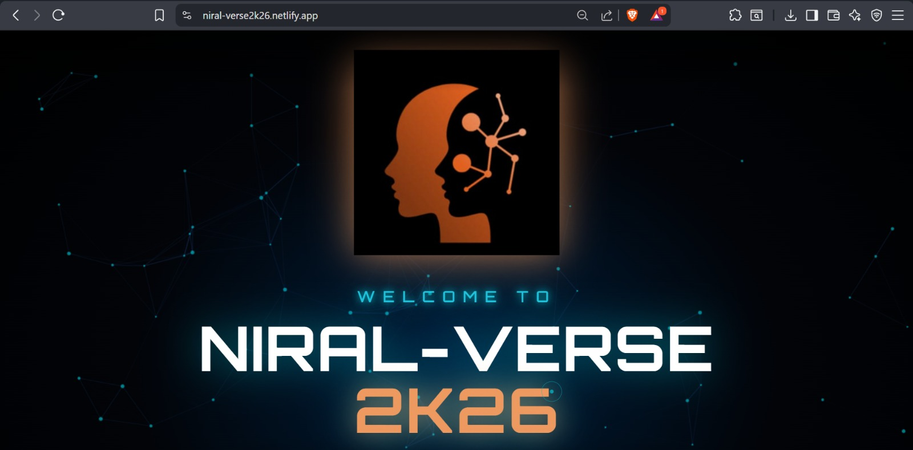
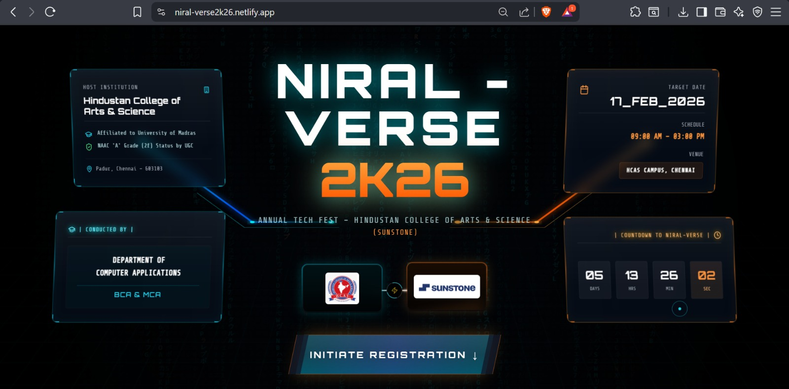

# Niral-Verse 2K26 🌐

**Niral-Verse 2K26** is a futuristic, immersive web portal designed for the annual tech fest conducted by the **Department of Computer Applications (BCA Sunstone)** at **Hindustan College of Arts & Science**.

This application features a high-fidelity Sci-Fi/Cyberpunk aesthetic, leveraging advanced animations and particle effects to create an engaging user experience for students registering for events.

## ✨ Key Features

- **Cinematic Entrance**: A particle-rich welcome screen with an orchestrated GSAP logo reveal.
- **Command Deck Hero**: A futuristic HUD (Heads-Up Display) interface featuring:
  - Digital Rain background effects.
  - Live Countdown timer to the event date.
  - Holographic glass panels with institution details.
- **Immersive Navigation**: "Warp speed" transition effects accompanied by sound design when navigating between sections.
- **Event Dashboard**:
  - Categorized browsing (Technical vs. Non-Technical).
  - Detailed "Event Protocols" (descriptions, rules, team size).
  - RPG-style "NPC" Event Heads with unique avatars and dialogue.
- **Registration System**:
  - Dynamic forms handling both solo and team-based inputs.
  - Client-side validation for college details.
- **Cyberpunk UI/UX**:
  - Custom magnetic cursor with lag effects.
  - Film grain overlays.
  - Neon glow typography and glassmorphism design.

## 📸 Screenshots

*(Ensure these files are present in your assets folder)*

| Welcome Screen | Command Deck |
|:---:|:---:|
|  |  |

## 🛠️ Tech Stack

- **Core**: [React 19](https://react.dev/)
- **Styling**: [Tailwind CSS](https://tailwindcss.com/)
- **Animation**: [GSAP (GreenSock Animation Platform)](https://gsap.com/)
- **Visuals**: [tsparticles](https://particles.js.org/) (Digital rain & starfields)
- **Icons**: [Lucide React](https://lucide.dev/)
- **Fonts**: Orbitron & Share Tech Mono (Google Fonts)

## 📂 Project Structure

```text
/
├── index.html                  # Entry point, CDN imports, Tailwind Config
├── index.tsx                   # React Root mount
├── App.tsx                     # Main Application Layout
├── metadata.json               # Project metadata
└── components/
    ├── WelcomeScreen.tsx       # Initial intro with logos
    ├── CommandDeckHero.tsx     # Main HUD landing page
    ├── MainContent.tsx         # Logic for switching between views
    ├── ParticlesBackground.tsx # tsparticles configuration
    ├── UIEffects.tsx           # Custom cursor and grain overlay
    ├── data/
    │   └── events.ts           # Event data configuration (modify events here)
    ├── dashboard/
    │   └── DashboardSection.tsx# Main event browsing interface
    ├── events/
    │   ├── EventZone.tsx       # Individual event detail view
    │   └── EventListItem.tsx   # List item component
    ├── modals/
    │   ├── NPCModal.tsx        # Event Head interaction modal
    │   ├── RegistrationFormModal.tsx
    │   └── RegistrationConfirmModal.tsx
    ├── transitions/
    │   ├── ArrivalCutscene.tsx
    │   └── TravelSequence.tsx
    └── ui/
        └── CustomScrollbar.tsx
```

## 🧠 Architecture Overview

- **State Management**: `MainContent.tsx` acts as the central router, orchestrating the transition between the Command Deck, Cutscenes, and the Dashboard. It utilizes React State alongside Session Storage to persist the user's location during reloads.
- **Data Driven**: All event protocols are centralized in `components/data/events.ts`. The UI components (`EventListItem`, `EventZone`, `NPCModal`) are agnostic and render dynamically based on this config file, allowing for easy updates to rules, images, and text.
- **Component Isolation**: 
  - **Modals**: Implemented as conditional overlays within the `DashboardSection` to ensure they sit above the 3D-transform layers.
  - **Effects**: Particle engines and Grain overlays are isolated in their own components to prevent re-render performance hits on the main UI.

## ⚡ Performance Optimizations

Given the heavy use of animations, several strategies are employed:
- **GSAP Context**: All animations use `gsap.context()` for proper cleanup in React `useEffect` hooks to prevent memory leaks.
- **Particle Management**: `tsparticles` is configured with `detectRetina: false` and capped particle counts to maintain 60FPS on standard devices.
- **Lazy Rendering**: The application uses conditional rendering to only mount heavy 3D dashboard components when the user actually enters the simulation, keeping the initial load light.

## 🔐 Current Limitations

- **Desktop First**: The interface is heavily optimized for mouse interaction (hover effects, custom cursors). While responsive, the full immersive experience is best viewed on a desktop/laptop.
- **Client-Side Simulation**: The current registration forms are front-end simulations (`setTimeout`). They do not currently persist data to a backend database, serving as a UI/UX demonstration.

## 🚀 Usage

This project utilizes **ES Modules** via CDN imports (`esm.sh`) defined in the `index.html` import map. This allows the application to run directly in modern browsers without a complex build step.

### Running Locally

1.  **Clone the repository** (or download the files).
2.  **Serve the directory** using any static file server.
    *   *Using Python:* `python3 -m http.server 8000`
    *   *Using Node:* `npx serve .`
    *   *VS Code:* Use the "Live Server" extension.
3.  Open `http://localhost:8000` in your browser.

## 🏆 Credits

**Conducted By:**
Department of Computer Applications (BCA Sunstone)
Hindustan College of Arts & Science, Chennai.

---
*Optimized for Desktop Interfaces*